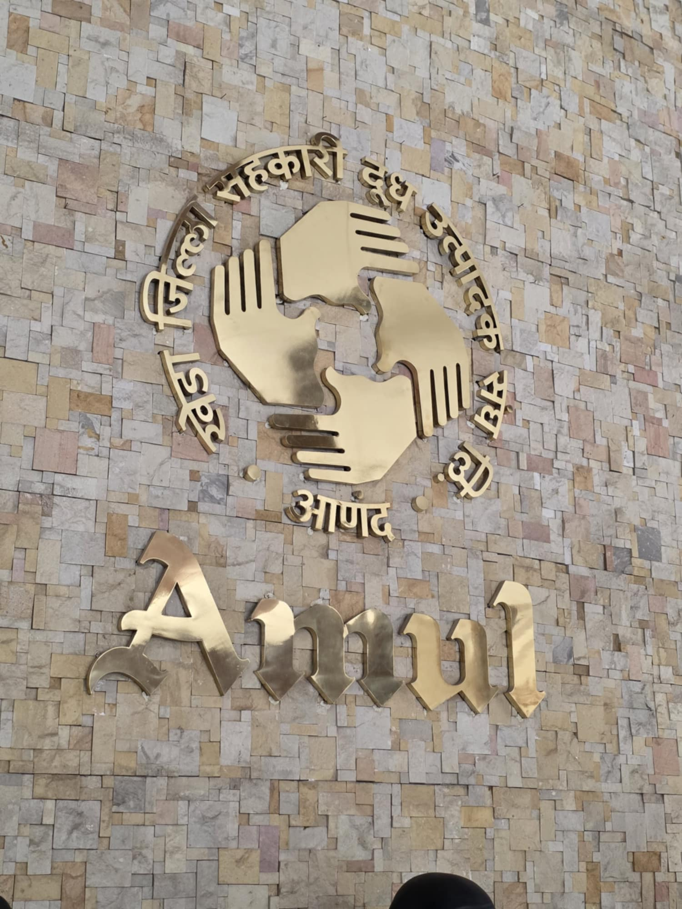
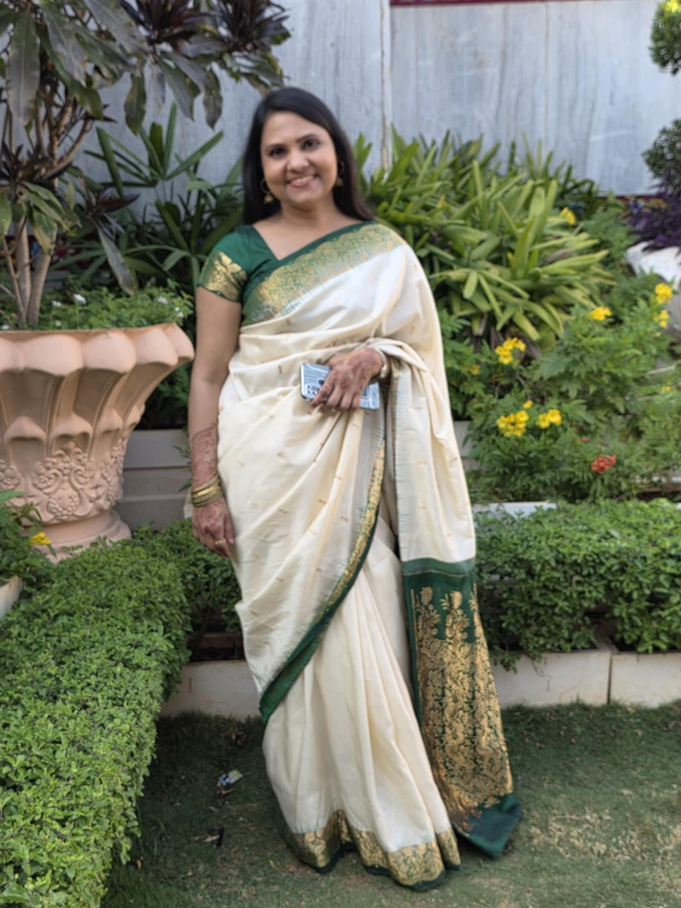

**Presented by:** Geeta Marmaat

This session focused on Indian communication strategies and the marketing and media landscape. A visit to their university further enhanced the international scope of the programme.

## Photos

::: {layout-ncol=2}

:::
