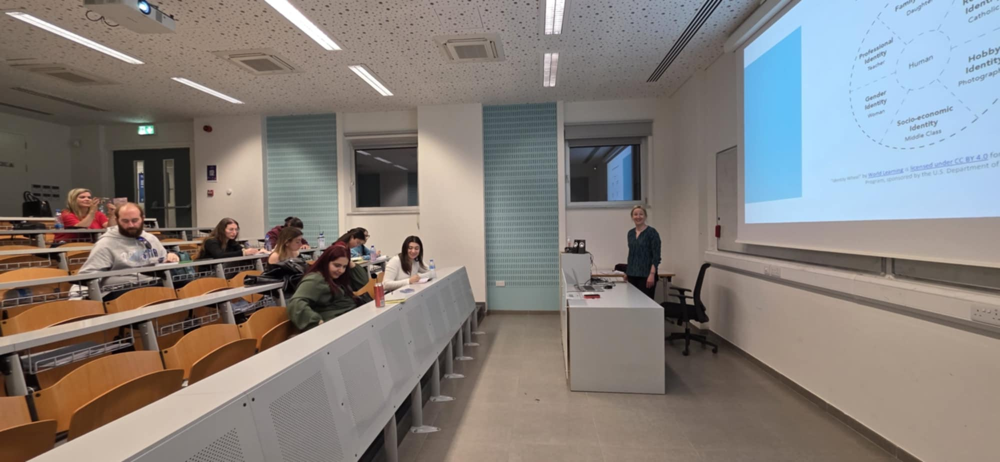
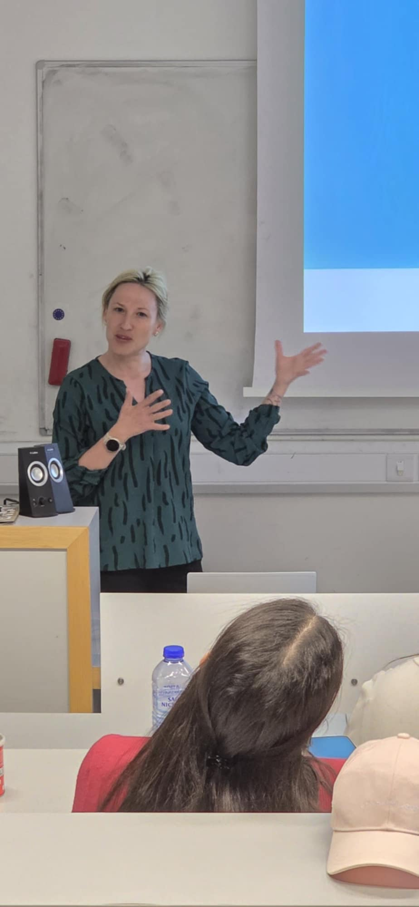

**Presented by:** Lucia Dančišinová and Eva Beňková

This session introduced a postgraduate program similar to our Master's in Marketing Communications, focusing on intercultural communication and presentation skills in a Slovak context.

## Photos

::: {layout-ncol=2}

:::
