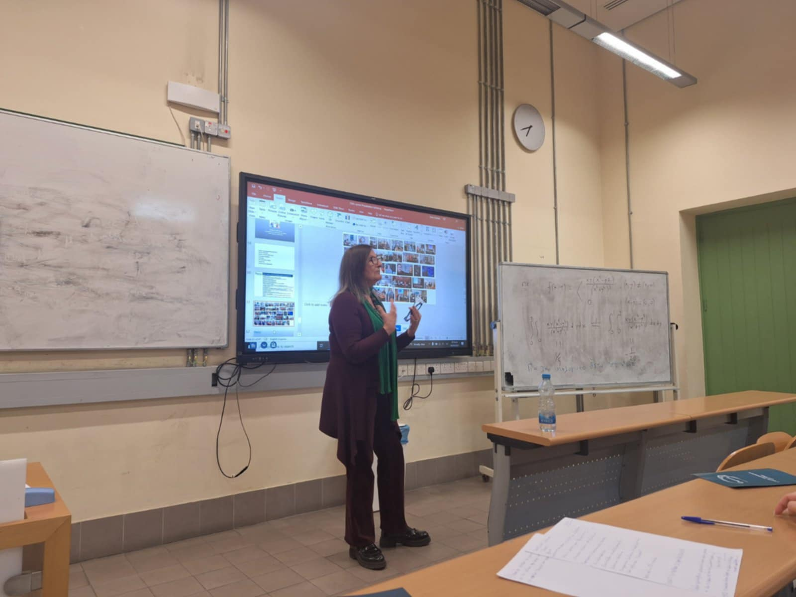
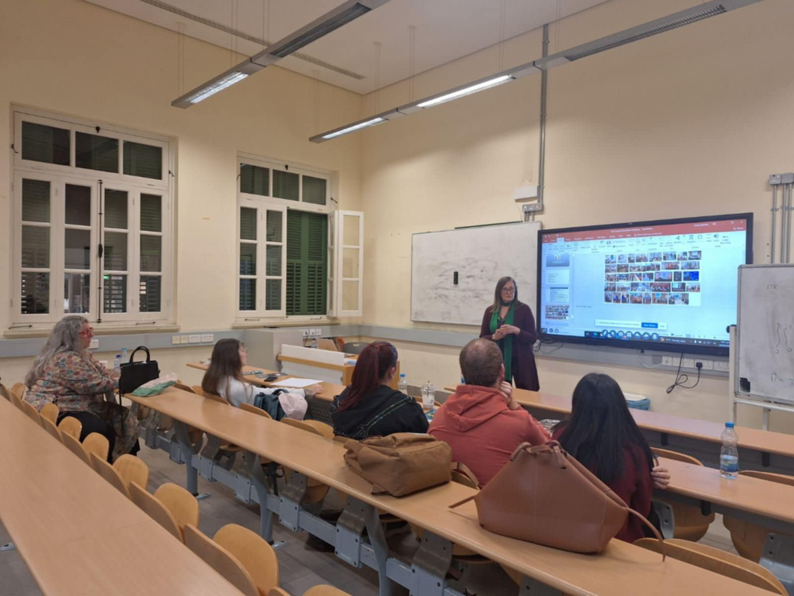
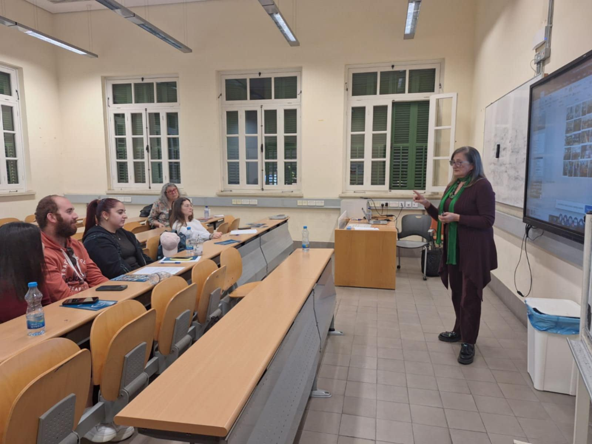
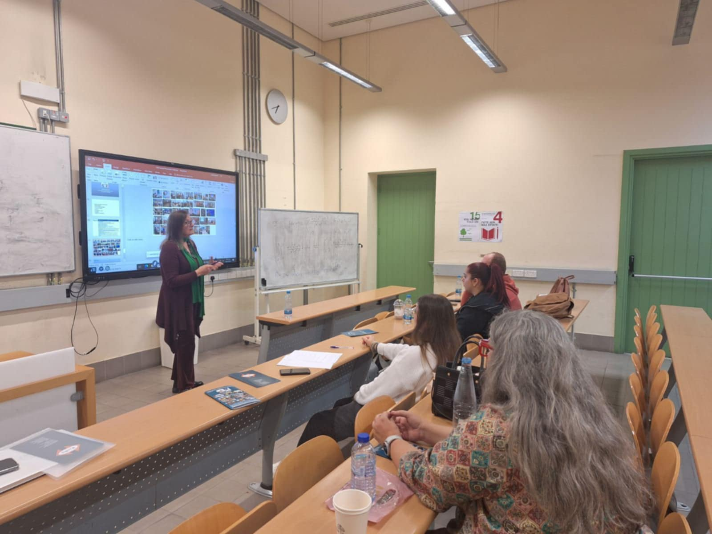

**Presented by:** Mairy Pyrgou, MSc — Public Affairs Consultant, President of Fimonoi

This presentation took place as part of the Reputation and Media Management course, focusing on the role of lobbying in influencing government decisions and shaping public perception in Cyprus.

## Photos

::: {layout-ncol=2}

:::
