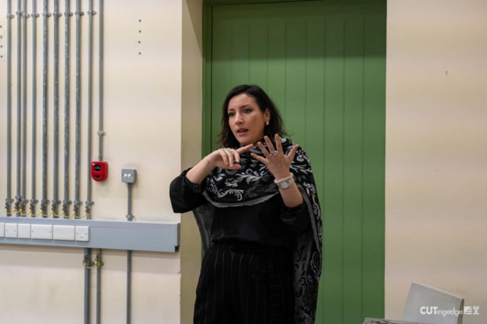
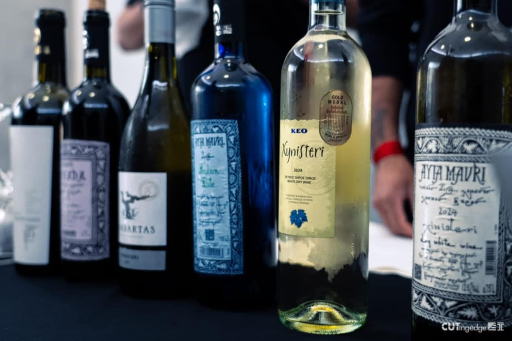

**Keynote speakers:**

- Dr. Maria Alempaki – Senior Researcher, Institute of Agricultural Economics and Sociology, ELGO-DIMITRA
- Elina Christofidou – Tourism Officer, Deputy Ministry of Tourism of Cyprus
- Ilias Makridis – Operations Coordinator, Cyprus Wine Core
- Michalis Georgiou – Wine Journalist

As part of the MSc in Experiential Digital Marketing Communications (XDMarComs@CUT), this seminar—organized with ELGO-DIMITRA and supervised by Dr. Maria Alempaki—examines wine tourism identity and digital branding in Cyprus.

## Photos

::: {layout-ncol=3}

:::
