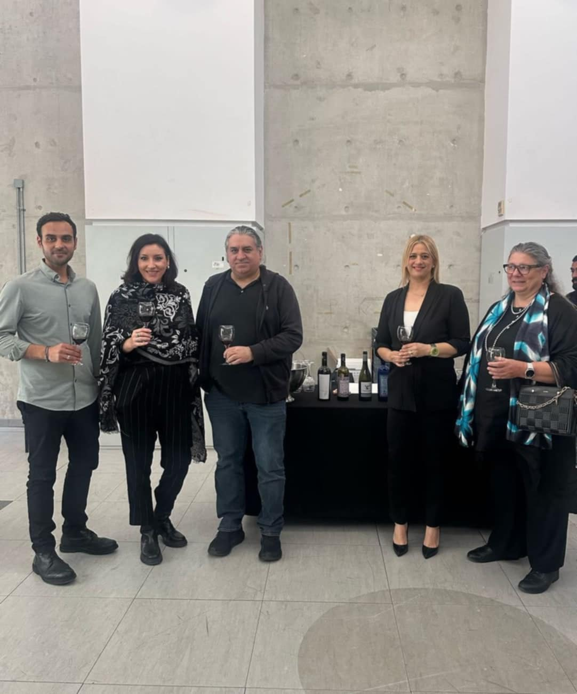
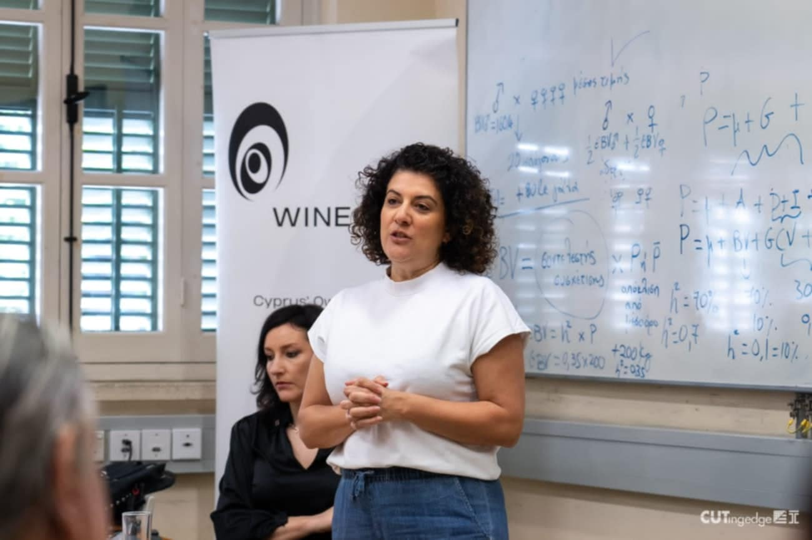
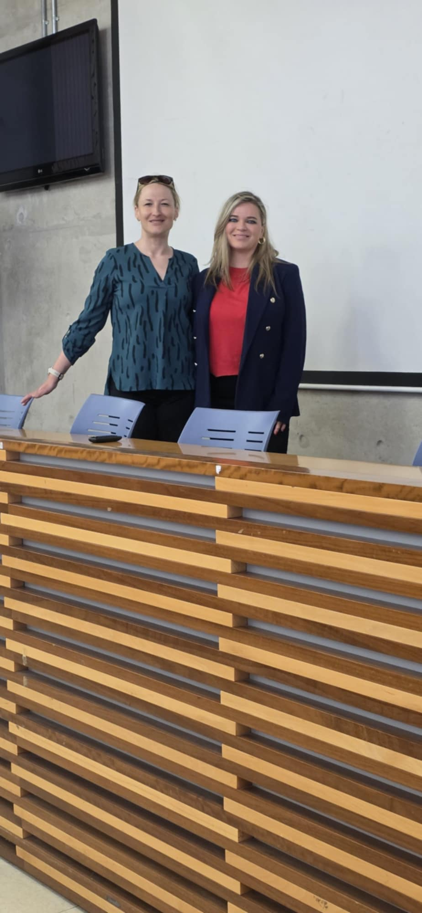

::: {.hero-banner}

{.crossfade-img}
{.crossfade-img}
{.crossfade-img}
{.crossfade-img}

# MSc in Experiential Digital Marketing Communications

**Department of Communication and Marketing**

**Cyprus University of Technology**

:::

::: {.section-dark-bg .bg-about}
## About the Programme

**Purpose:** To empower ambitious students and professionals to master digital storytelling, navigate the data-driven marketing landscape, and lead brands in delivering meaningful, memorable experiences to the connected consumer.

**Mission:** To foster a student-centric, innovation-driven learning environment where individuals thrive academically, professionally, and personally. The programme develops:

- Advanced skills in AI, data analytics, IoT, and phygital marketing.
- Essential soft skills such as adaptability, agility, resilience, and collaboration.
- The capacity to create sustainable value in an ever-evolving digital landscape.

**Key Features:**

- **Flexible Learning:** Hybrid programme with intensive five-week modules combining weekend classes, online seminars, and self-paced content for working professionals.
- **Cross-Disciplinary Approach:** Integrates technology, psychology, analytics, design, and communication for strategic, well-rounded marketing expertise.
- **Continuous Growth:** Develops self-directed learning skills to help graduates adapt and thrive in evolving digital marketing landscapes.
:::

::: {.cta-band}
Ready to advance your career in digital marketing?

[Apply Now](applications.qmd){.btn-hero}
:::

::: {.photo-ticker}
:::: {.ticker-track}

::::
:::
