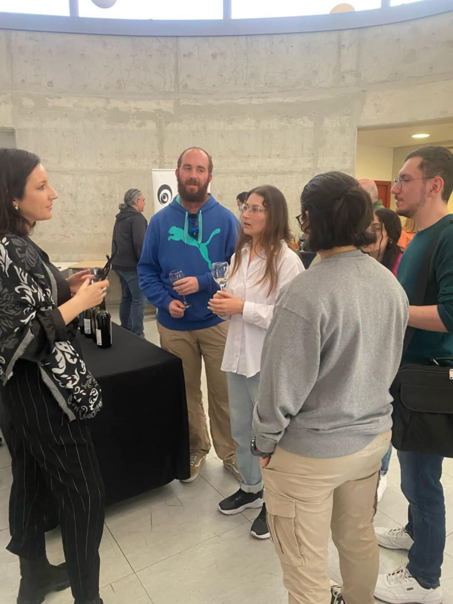
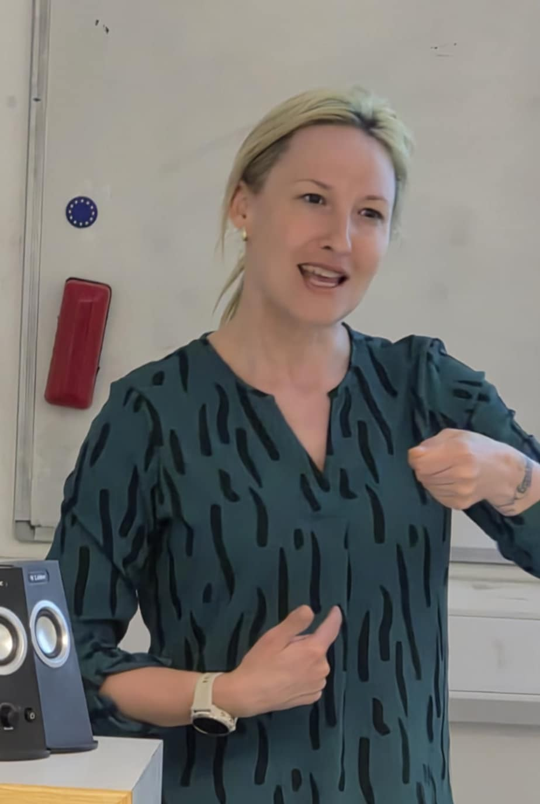
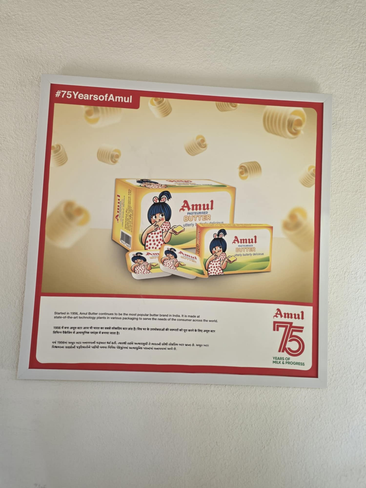
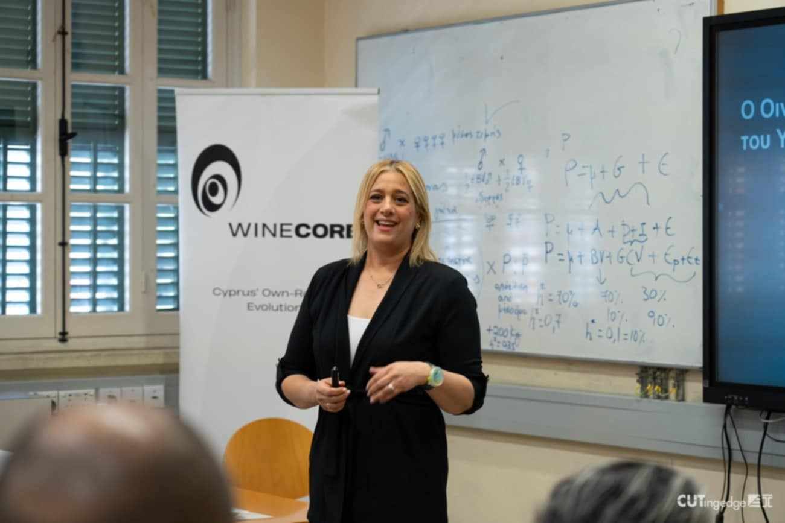
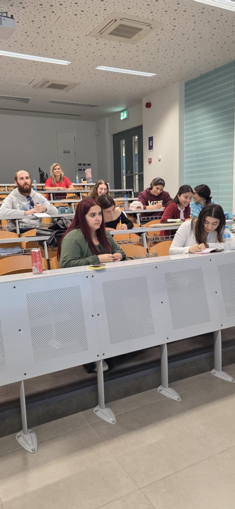
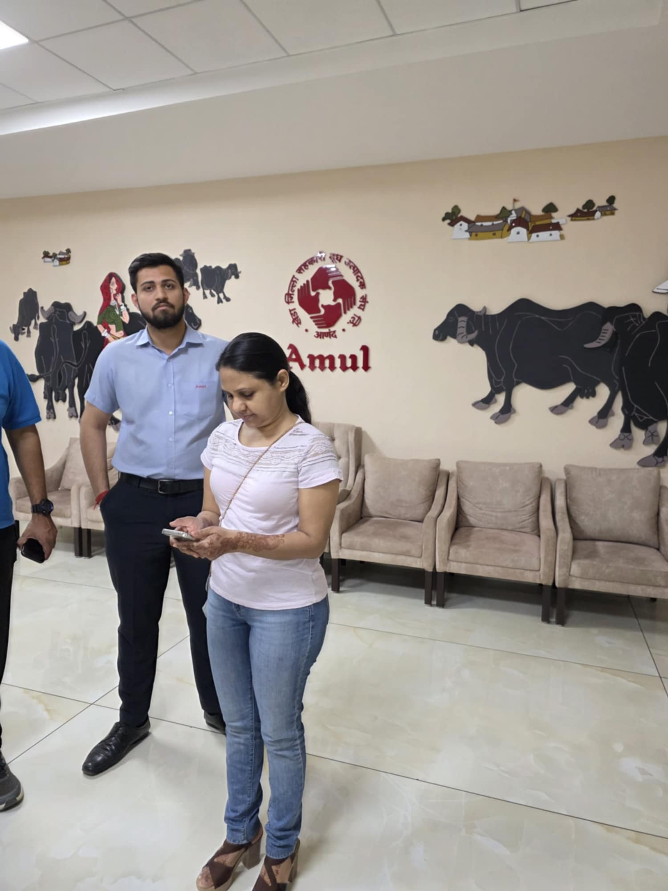

::: {.hero-banner}

{.crossfade-img}
{.crossfade-img}
{.crossfade-img}
{.crossfade-img}

# MSc in Experiential Digital Marketing Communications

**Department of Communication and Marketing**

**Cyprus University of Technology**

:::

::: {.section-dark-bg .bg-about}
## About the Programme

**Purpose:** To empower ambitious students and professionals to master digital storytelling, navigate the data-driven marketing landscape, and lead brands in delivering meaningful, memorable experiences to the connected consumer.

**Mission:** To foster a student-centric, innovation-driven learning environment where individuals thrive academically, professionally, and personally. The programme develops:

- Advanced skills in AI, data analytics, IoT, and phygital marketing.
- Essential soft skills such as adaptability, agility, resilience, and collaboration.
- The capacity to create sustainable value in an ever-evolving digital landscape.

**Key Features:**

- **Flexible Learning:** Hybrid programme with intensive five-week modules combining weekend classes, online seminars, and self-paced content for working professionals.
- **Cross-Disciplinary Approach:** Integrates technology, psychology, analytics, design, and communication for strategic, well-rounded marketing expertise.
- **Continuous Growth:** Develops self-directed learning skills to help graduates adapt and thrive in evolving digital marketing landscapes.
:::

::: {.cta-band}
Ready to advance your career in digital marketing?

[Apply Now](applications.qmd){.btn-hero}
:::

<h2>Programme Highlights</h2>

<button type="button" data-bs-target="#highlightsCarousel" data-bs-slide-to="0" class="active"></button>
<button type="button" data-bs-target="#highlightsCarousel" data-bs-slide-to="1"></button>
<button type="button" data-bs-target="#highlightsCarousel" data-bs-slide-to="2"></button>
<button type="button" data-bs-target="#highlightsCarousel" data-bs-slide-to="3"></button>

<a href="events/lobbying-cyprus.html">

<h3>Lobbying and Public Affairs in Cyprus</h3>

Mairy Pyrgou on lobbying, government decisions, and public perception.

</a>

<a href="events/wine-tourism.html">

<h3>Shaping the Wine Tourism Identity of Cyprus</h3>

A seminar on wine tourism identity and digital branding with ELGO-DIMITRA.

</a>

<a href="events/intercultural-comms.html">

<h3>Intercultural Communication — Marcoms in Slovakia</h3>

Lucia Dančišinová and Eva Beňková on intercultural communication skills.

</a>

<a href="events/india-marketing.html">

<h3>The Marketing and Media Landscapes of India</h3>

Geeta Marmaat on Indian communication strategies and the media landscape.

</a>

<button class="carousel-control-prev" type="button" data-bs-target="#highlightsCarousel" data-bs-slide="prev">

Previous
</button>
<button class="carousel-control-next" type="button" data-bs-target="#highlightsCarousel" data-bs-slide="next">

Next
</button>

<a href="events.html">See all highlights &rarr;</a>

